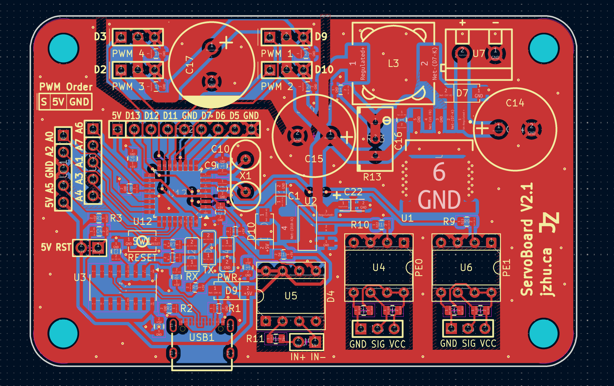
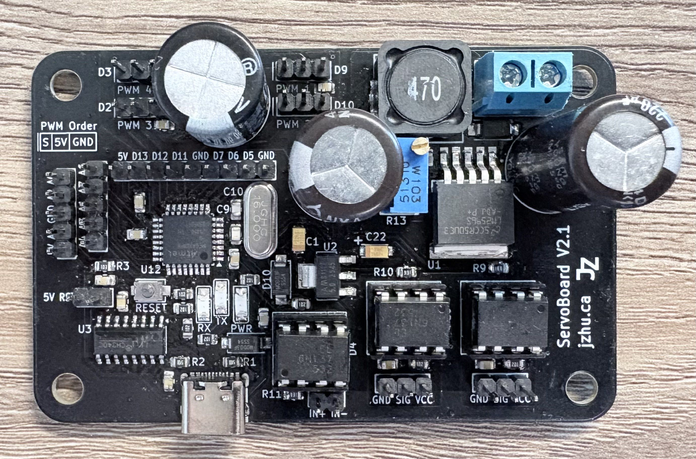
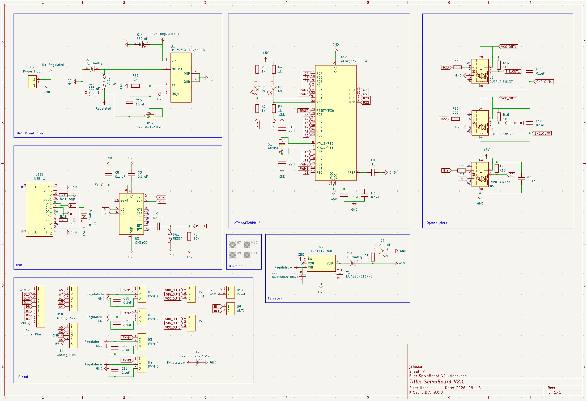
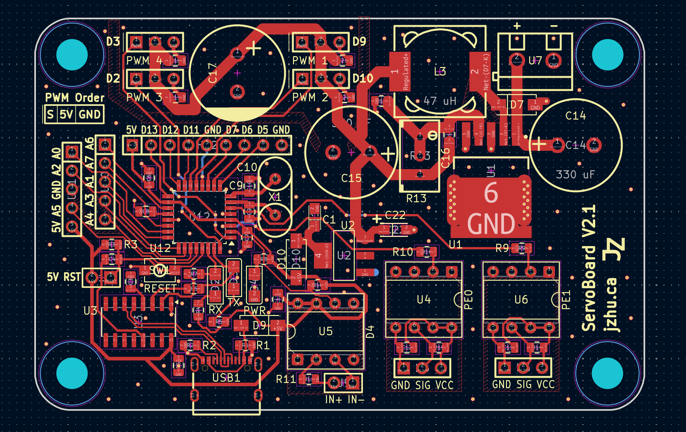
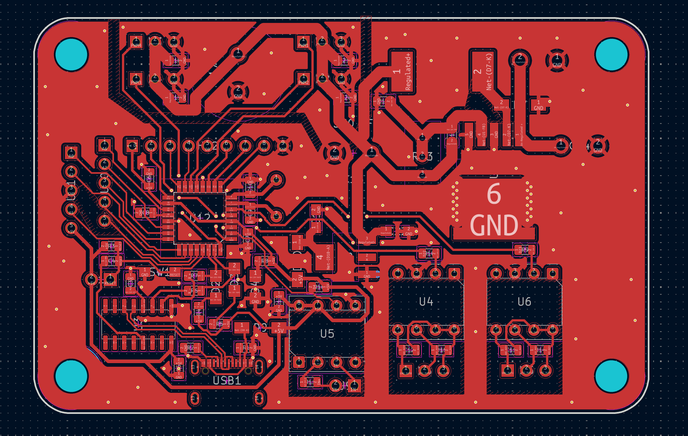
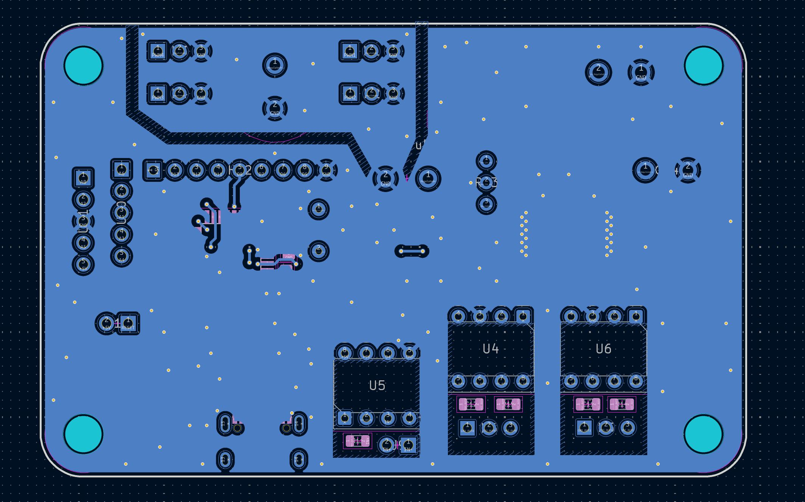

# ServoBoard V2.1
  

## Introduction
This project contains a 2 layer PCB that has the designed purpose of driving up to 4 PWM servo motors of variable input voltage, with the entire board itself being powered by a variable voltage.  
This board is controlled by an atmega328PB and has 6n137 optocouplers.

## Microcontroller
The microcontroller (MCU) on this board is the atmega328PB which can be programmed via the USB-C connection on the side of the board through the use of a CH340C USB-to-UART serial converter IC.  
The atmega328PB was chosen as it is a simple and stable MCU that can be programmed using the Arduino IDE, and is an upgrade over the atmega328.
The MCU utilizes an external 16 MHz crystal oscillator. 

Note: the USB connection can only be used after initial bootloader burning (see ISP section).

## Power
There are 3 different voltages present on the board: input, servo, and 5V. 

Using the LM2596S buck voltage regulator, the board can utilize a maximum of 3A at the output of the Buck regulator. 
The efficiency of the LM2596S 92%. The board accepts a voltage range of 40V and can step it down to 1.25V-35V.
You can adjust the output voltage of the LM2596S by adjusting the screw on the blue potentiometer.
The potentiometer acts as a voltage divider which alters the internal PWM duty cycle. 

The use of an AMS1117-5.0 fixed 5V low dropout linear voltage regulator further steps down the voltage from the servo voltage to 5V to power the MCU.
The dropout range is 1.3V with a max input voltage of 15V.

Note: you should be careful when adjusting output of the LM2596S when using voltages higher than 15V as you can potentially destroy the AMS1117 LDO.
Additionally, the servo voltage should be high enough such that the MCU after the LDO has sufficient a sufficient voltage.

## Servo PWM pins
Servo motors can be driven using one or many of the 4 sets of SIGNAL-POWER-GROUND male header pins. 
The connected servo motors are driven by the voltage output of the LM2596S Buck Converter. 
A large 2200uF capacitor is placed very close to the servo pin headers to provide power during momentary high current draw. 

## Optocouplers
The Board contains 3 6n137 high-speed digital Optocouplers, mounted on DIP-8 sockets, allowing for interfacing with optical isolation.
The 6n137 mounted on the U5 DIP-8 socket is oriented as an input for digital signals while U4 and U6 are oriented as outputs.

## Board Design
This Board utilizes a 2 layer stackup. The top layer is signal with a ground pour.
The bottom layer is a ground plane of which effort was put in to ensure as much continuity as possible. 
The top and bottom ground layers are connected via stitching.
A power plane and cut is placed around the servo pin headers so that surges of power are drawn from the nearby capacitor.
Extra thermal vias are placed around the ground pin of the LM2596S.

## In-System Programming (ISP)
Following the assembly of the board you will need to do burn the bootloader of the board to be able to use the USB-C port to program the atmega328PB. 
To do this, it is recommended to use any Arduino in addition to its ability to be an [ISP flasher](https://docs.arduino.cc/built-in-examples/arduino-isp/ArduinoISP/).

### Schematic

### Board Without Pours

### Top Copper

### Bottom Copper

## Application
The design application of this board is within a CNC White board plotter //add link for which this board controls a pen plotter that is controlled by an Ardunio CNC Shield, interfacing through an optocoupler.
The board input voltage is 12V, with the servo needing 7V.

## BOM
The cost of each board at low production quantities is around $15 CAD.

## LICENSE
[ServoBoard](https://github.com/jeffrey500/ServoBoard) © 2026 by [Jeffrey Zhu](https://jzhu.ca) is licensed under [CC BY-NC 4.0](https://creativecommons.org/licenses/by-nc/4.0/)

